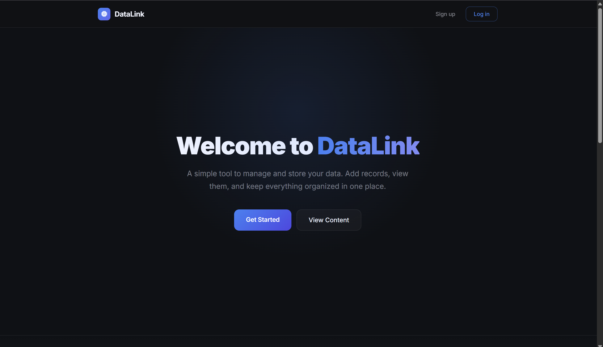
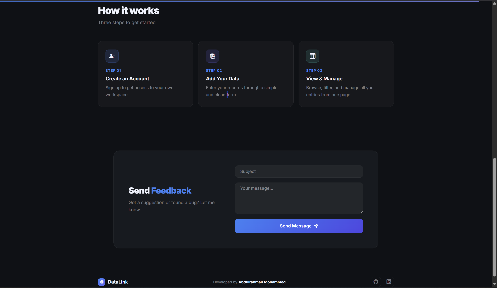
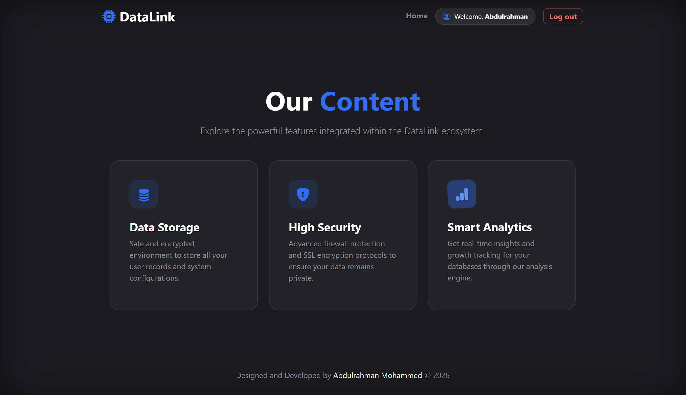
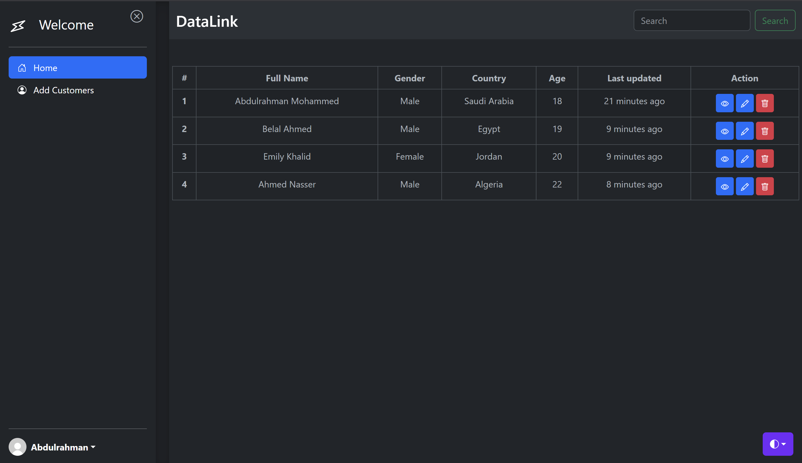

# 🚀 UserFlow – Advanced User Management System


**UserFlow** is a powerful full-stack application designed for seamless user database management. Built with a focus on **UX/UI excellence** using **Bootstrap 5**, it provides a complete environment for handling user data with security and speed.

---

## 📸 System Showcase (Desktop UI)

<p align="center">
  
  
  
</p>

<p align="center">
  
</p>

---

## ✨ Key Features

### 🔐 Access Control & Security
- **Smart Authentication:** Secure login and registration flows for protected access.
- **Data Privacy:** Optimized backend logic to ensure user data integrity.
- **Validation:** Server-side and client-side validation for all entry forms.

### ⚙️ Database Management (CRUD)
- **Centralized Dashboard:** A clean, Bootstrap-powered table to monitor all users.
- **Advanced Search:** Instant filtering to find any user record in seconds.
- **Full Control:** - ➕ Create new user entries with ease.
    - 👁️ View in-depth details for each record.
    - 🗑️ Secure deletion with interactive prompts.

### 🎨 Modern Experience
- **Bootstrap 5 UI:** Clean components, responsive grids, and modern typography.
- **User Journey:** A logical flow starting from an inviting **Landing Page** to the **Content Discovery** and final **Dashboard**.

---

## 🛠 Tech Stack

- **Backend:** Node.js & Express.js
- **Database:** MongoDB with Mongoose ODM
- **Frontend:** EJS Template Engine & **Bootstrap 5**
- **Styling:** Custom CSS for specialized UI enhancements
- **Environment:** Dotenv for secure configuration

---

## 📂 Project Structure

```text
PROJECT-DB
├── controllers/          # Business logic for routes
├── middleware/           # Auth and security checks
├── models/               # Mongoose Schemas
│   ├── customerSchema.js
│   ├── feedbackSchema.js
│   └── signupSchema.js   # User registration logic
├── routes/               # API endpoints & page routing
├── views/                # EJS Templates
│   ├── auth/             # Login & Registration views
│   ├── Components/       # Reusable UI parts (Header/Footer)
│   ├── user/             # Dashboard (add, edit, search, view)
│   ├── index.ejs         # Main Content page
│   └── welcome.ejs       # Landing page
├── public/               # Static assets (CSS, JS, Images)
├── app.js                # Server entry point
├── .env                  # Environment variables
├── .gitignore            # Git exclusion rules
└── package.json          # Dependencies & Scripts

🚀 Getting Started

1. Clone the Repo: git clone https://github.com/Abdulrahman2127/project-DB
2. Install Dependencies: npm install
3. Setup Environment: Configure your .env with MONGODB_URL and password_jwt.
4. Run Server: npm start

👨‍💻 Author
Abdulrahman Backend Developer | Node.js • Express • MongoDB 